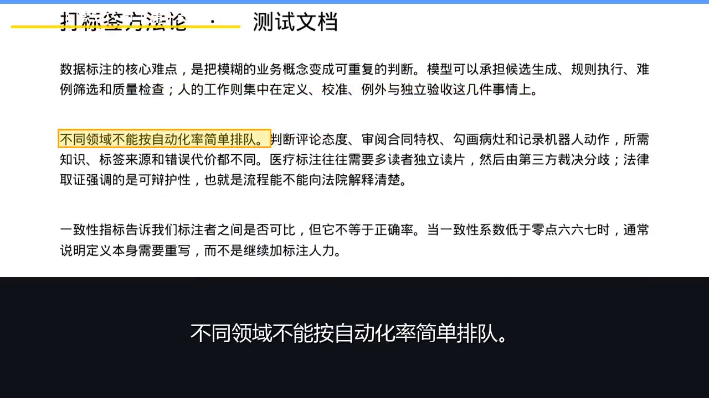

# PDF Readalong — Turn a PDF into a Read-Along Video

[中文](README.md) | **English**

A Windows desktop tool for teachers and knowledge creators who keep producing handout videos: it turns a text-based PDF into a video with **narration, line-by-line highlighting, and large subtitles**, controlled from a local browser UI. The highlight follows the narration — whichever line is being read lights up on the original page — and the audio reads the document sentence by sentence, so you can follow along even without watching the screen.

## See it in action

The frame below is the raw 0:20 frame of a video generated directly from this repository's source in the current release — actual output, not re-rendered:



Real input: [测试文档.pdf](assets/测试文档.pdf) — a 2-page Chinese test handout. This release extracted **15 reading units (437 characters)** and synthesized them with the Yunxi voice (`zh-CN-YunxiNeural`) at the default rate, producing one video volume plus audio and subtitles:

| Input / output | Measured on the build machine |
|---|---|
| Input PDF | 3,241 bytes, 2 pages |
| `测试文档_第1卷.mp4` | **1280×720 / 30 fps / 2,583 frames / 86.130 s**; H.264 + AAC; 2,345,781 bytes |
| `测试文档_第1卷_纯音频.mp3` | 689,709 bytes |
| `测试文档_第1卷.srt` | 1,882 bytes, 15 subtitles |

The media files live under `jobs/source-smoke/` on the build machine and are not committed, per repository rules. You can regenerate them with the verified commands below; file evidence and SHA-256 hashes are in [Demo evidence](assets/demo-evidence.md). Uploads made through the web UI are saved under `jobs/<job-id>/`, and the page offers video, audio, and subtitle downloads.

Two more existing artifacts — don't mistake the screen-recording specs for export-video specs:

| Existing artifact | Specs and provenance |
|---|---|
| Earlier acceptance video (handout export) | **1280×720 / 30 fps / 5,266 frames / 175.55 s**; confirmed during project handover, adopted as-is, not re-measured in this release; the matching input and file identification are still to be supplied before publication |
| Full-workflow screen recording | Archive file `演示_全流程_修复版_83.1s.mp4`, read this release: **1280×896 / 20 fps / 1,663 frames / 83.150 s**; this is a screen recording, not a 720p export |

Another public input is [演示文档.pdf](assets/演示文档.pdf) — 3 pages of a Chinese document on making long documents listenable. This release confirmed it yields 36 reading units (915 characters). It corresponds to the existing workflow demo; no full video was regenerated from it in this release. The demo video is not in the repository yet, and there is no public video URL yet.

## Run from source

Verified environment for this release: **Windows 10 x64 (19045), CPython 3.12.10, FFmpeg / ffprobe 8.1.1 essentials build**. Runtime dependencies are pinned in [requirements.txt](requirements.txt); this source release provides the online `edge-tts` voice mode.

Install Python 3.12 (with the Windows `py` launcher) and FFmpeg including `ffmpeg.exe` and `ffprobe.exe`, then add the latter two to `PATH`. The system needs `C:/Windows/Fonts/msyh.ttc` and `C:/Windows/Fonts/msyhbd.ttc`. These installs were **not verified on a clean machine** — the build machine already had all of them, so no unverified install commands are given here.

Every command below was actually executed in **PowerShell**. Clone the repository (or download the source ZIP from its page); if you keep the source elsewhere, adjust only the first line:

```powershell
Set-Location pdf-readalong
py -3.12 --version
py -3.12 -m venv .venv
./.venv/Scripts/python.exe -m pip install -r requirements.txt
$env:FFMPEG = (Get-Command ffmpeg.exe).Source.Replace('\', '/')
$env:FFPROBE = (Get-Command ffprobe.exe).Source.Replace('\', '/')
& $env:FFMPEG -version
& $env:FFPROBE -version
./.venv/Scripts/python.exe -m pip check
./.venv/Scripts/python.exe -m uvicorn app:app --host 127.0.0.1 --port 18756
```

With the server running, open **http://127.0.0.1:18756/** in a browser, upload the PDF above, pick a voice and rate, then generate. The last command was verified to start the service and return HTTP 200 on the home page; the browser upload-and-click flow was **not** completed in this release. Stop the server with `Ctrl+C`. The example binds to localhost; treat this as a local tool.

Command-line generation also passed end to end. Stop the server (or open a second PowerShell in the same source directory) and use the same FFmpeg environment variables:

```powershell
./.venv/Scripts/python.exe pipeline.py --help
./.venv/Scripts/python.exe pipeline.py "assets/测试文档.pdf" -o jobs/source-smoke
```

On the build machine, the command-line run used the code's default `C:/ProgramData/chocolatey/bin/ffmpeg.exe` and `ffprobe.exe`. For other install locations, set `FFMPEG` / `FFPROBE` as above. The current way the code calls FFmpeg is **not verified for executable paths containing spaces** — prefer a path without spaces.

If you use Git Bash on Windows, run the examples on this page in PowerShell. Absolute paths passed to native `python.exe` / `git.exe` / `ffmpeg.exe` must be written as `D:/...`, not `/d/...`; prefer passing Chinese filenames via Python `subprocess` argument lists. This page deliberately gives no unverified Bash commands.

## How it works

PyMuPDF reads text and coordinates from the PDF text layer and groups them into sentence-level reading units. Speech is synthesized online, sentence by sentence, decoded to PCM, and trimmed of leading and trailing silence. Pillow draws the line highlight and subtitles over the original page images; FFmpeg muxes frames and audio into an MP4, and also writes MP3 and SRT. Long material can be split into volumes (default cap: 9.5 minutes per volume).

Core entry points: `app.py` and `pipeline.py`. The screen-recording, measurement, and `history/` files exist for development traceability; some of those scripts still contain the author's local paths and additional dependencies, and they are not part of the run path above.

## Limitations

- **Use this only with files and systems that have been tested.** Full conversion was verified only on the 2-page test PDF; the 3-page demo PDF was verified for extraction only. Other Windows versions, complex multi-column layouts, equations, dense tables, and arbitrary user handouts have not been comprehensively tested.
- A text layer is required. Scanned documents need OCR first; this project has no built-in OCR. Sentence segmentation, table reading order, and content accuracy need manual review.
- The online mode needs internet access, and the text being read is sent to the speech service; network conditions, service availability, and service terms can affect use. The code may skip sentences when speech synthesis fails — check the subtitle count against the input units rather than trusting a completed progress bar.
- The local-speech mode mentioned in background materials needs a separate ≈2.4 GB model download. **This repository version has no `tts_local.py` and no local mode** — it was not downloaded, not tested, and its model name and license were not confirmed in this release. Do not read this as a promise of an offline feature in the current source.
- For very long sentences, on-screen subtitles draw at most 3 lines; the white top status text can overlap white-background PDF content. The overlap is visible in the current screenshot; this release prepared materials only and did not fix the runtime code.
- No conversion time or RTF was recorded in this release, so there is no performance baseline; audio/video sync has also not been verified across arbitrary files.

## License, complete source, and the paid bundle

Original project code is licensed **AGPL-3.0-only** — full text in [LICENSE](LICENSE). Third-party components keep their own licenses and copyrights; see [Third-party notices](THIRD_PARTY_NOTICES.md). **Copyright (C) 2026 lawrencezy.**

**PyMuPDF / MuPDF is dual-licensed (AGPL-3.0 or Artifex commercial); this project uses the AGPL branch.** Distributing covered programs or modified versions requires the applicable copyright notices, the license, and the complete Corresponding Source. For binary distribution, AGPL section 6 applies; and if a modified version supports remote network interaction, section 13 additionally requires prominently offering the source of that running version. Attaching a license text alone, shipping outdated code, or hiding a covered paid implementation does not satisfy these obligations. See the [PyMuPDF license notes](https://pymupdf.readthedocs.io/en/latest/about.html#license-and-copyright) and the [full AGPL text](https://www.gnu.org/licenses/agpl-3.0.html).

**Where to get the source:** this repository contains the current version's code, the pinned dependency lockfile, and run instructions; you can `git clone` it or download the source ZIP from its page. Any download page for the paid bundle must also offer a complete, no-extra-fee Corresponding Source entry matching the exact distributed version, including applicable build/install scripts and dependency source. The repository has not yet been reconciled with the paid bundle that is being finalized; details are in the release checklist (Chinese): [发布检查清单](发布检查清单.md).

**The code is free; the optional RMB 39 portable bundle supports the author.** It pre-packages portable Python, FFmpeg, and the app runtime, so you skip installing Python, creating a virtual environment, installing dependencies, and configuring FFmpeg paths — unzip and run. The existing bundle is **284–298 MB** (range confirmed in project handover, not re-measured this release; different build outputs may vary). It does not include the ≈2.4 GB local speech model. No purchase channel is set up yet.

The fee covers the convenience of the packaged bundle and the support delivered; they do not change the source, modification, and redistribution rights that the AGPL/GPL grant to recipients. This source repository intentionally excludes the portable runtime, installers, models, test media, and user jobs; **this arrangement does not exempt covered paid bundles from their complete Corresponding Source obligations.**
